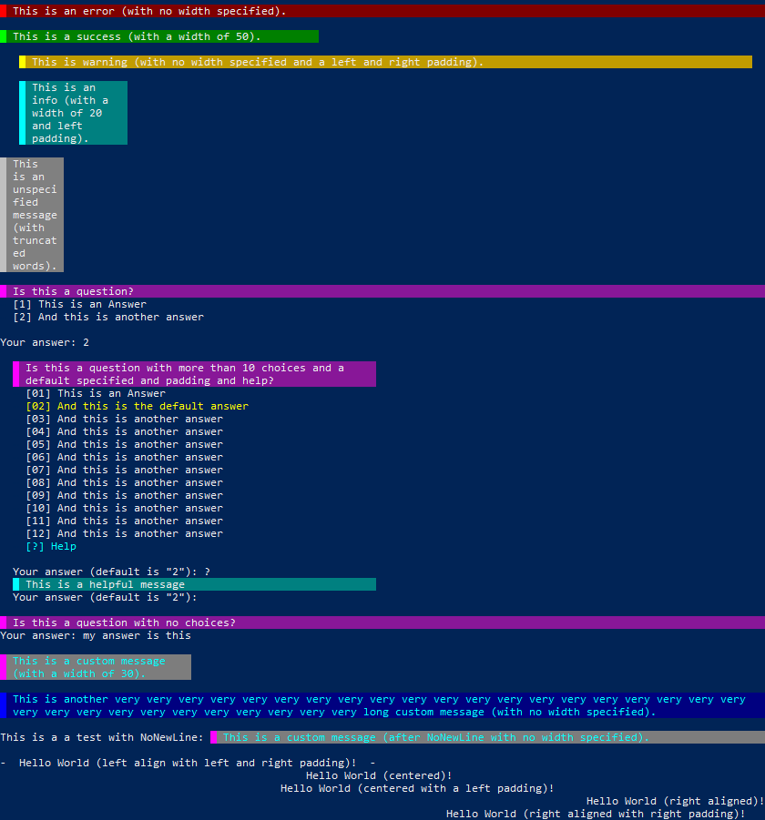

# Bca.Text
 [](https://opensource.org/licenses/MIT)

[](https://github.com/baptistecabrera/bca-text/releases) [](https://www.powershellgallery.com/packages/Bca.Text) [](https://www.nuget.org/packages/Bca.Text/) [](https://chocolatey.org/packages/bca-text)

## Description

_Bca.Text_ is a PowerShell module used to format text to be used for more user-friendly outputs.

It contains functions to show different pre-defined message types (error, warning, ...), customize your messages, questions requiring user inputs (with or without defined choices), aligning strings on the console, and to colorize text from RGB or Hex color values (instead or just having `ConsoleColor` as an option).

## Disclaimer

- _Bca.Text_ has been created to answer my needs, but I provide it to people who may need such a tool.
- It may contain bugs or lack some features, in this case, feel free to open an issue, and I'll manage it as best as I can.
- Some feature are not yest cross-platform.
- This _GitHub_ repository is not the primary one, but you are welcome to contribute, see transparency for more information.

## Dependencies

- _(none)_

## Examples



## Documentation
Find extended documentation [at this page](doc/ReadMe.md).

## How to install

### The easiest way

In a PowerShell console, run the following:
```powershell
Find-Module -Name Bca.Text | Install-Module
```

### Package

_Bca.Text_ is available as a package from _[PowerShell Gallery](https://www.powershellgallery.com/)_, _[NuGet](https://www.nuget.org/)_ and _[Chocolatey](https://chocolatey.org/)_*, please refer to each specific plateform on how to install the package.

\* Availability on Chocolatey is subject to approval.

### Manually

If you decide to install _Bca.Text_ manually, copy the content of `src` into one or all of the path(s) contained in the variable `PSModulePath` depending on the scope you need.

I'll advise you use a path with the version, that can be found in the module manifest `psd1` file (e.g. `C:\Program Files\WindowsPowerShell\Modules\Bca.Text\1.0.0`). In that case copy the content of `src/Bca.Text` in this path.

## Transparency

_Please not that to date I am the only developper for this module._

- All code is primarily stored on a private Git repository on Azure DevOps;
- Issues opened in GitHub create a bug in Azure DevOps; [](https://github.com/baptistecabrera/bca-text/actions?query=workflow%3A"Sync+issue+to+Azure+DevOps")
- All pushes made in GitHub are synced to Azure DevOps (that includes all branches except `master`); [](https://github.com/baptistecabrera/bca-text/actions?query=workflow%3A"Sync+branches+to+Azure+DevOps")
- When a GitHub Pull Request is submitted, it is analyzed and merged in `develop` on GitHub, then synced to Azure DevOps that will trigger the CI;
- A Pull Request is then submitted in Azure DevOps to merge `develop` to `master`, it runs the CI again;
- Once merged to `master`, the CI is one last time, but this time it will create a Chocolatey and a NuGet packages that are pushed on private Azure DevOps Artifacts feeds;
- If the CI succeeds and the packages are well pushed, the CD is triggered.

### CI
[](https://dev.azure.com/baptistecabrera/Bca/_build/latest?definitionId=33&repoName=bca-text&branchName=master)

[](https://dev.azure.com/baptistecabrera/Bca/_build/latest?definitionId=33&repoName=bca-text&branchName=master) [](https://dev.azure.com/baptistecabrera/Bca/_build/latest?definitionId=33&repoName=bca-text&branchName=master)

The CI is an Azure DevOps build pipeline that will:
- Test the module and does code coverage with _[Pester](https://pester.dev/)_;
- Run the _[PSScriptAnalyzer](https://github.com/PowerShell/PSScriptAnalyzer)_;
- Mirror the repository to GitHub

### CD
[](https://dev.azure.com/baptistecabrera/Bca/_build/latest?definitionId=34&repoName=bca-text&branchName=master)

[](https://dev.azure.com/baptistecabrera/Bca/_build/latest?definitionId=34&repoName=bca-text&branchName=master) [](https://dev.azure.com/baptistecabrera/Bca/_build/latest?definitionId=34&repoName=bca-text&branchName=master)

The CD is an Azure DevOps release pipeline is trigerred that will:
- In a **Prerelease** step, install both Chocolatey and Nuget packages from the private feed in a container, and run tests again. If tests are successful, the packages are promoted to `@Prerelease` view inside the private feed;
- In a **Release** step, publish the packages to _[NuGet](https://www.nuget.org/)_ and _[Chocolatey](https://chocolatey.org/)_, and publish the module to _[PowerShell Gallery](https://www.powershellgallery.com/)_, then promote the packages to to `@Release` view inside the private feed.
